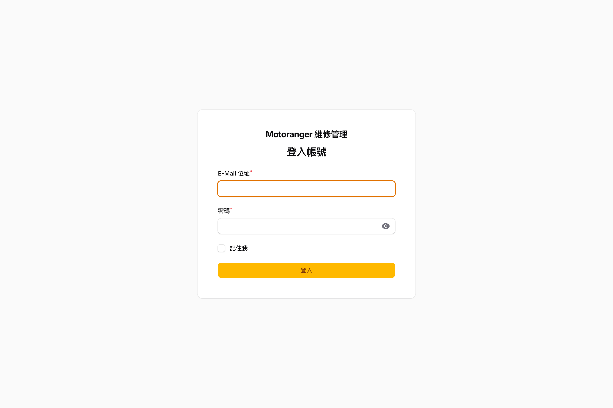
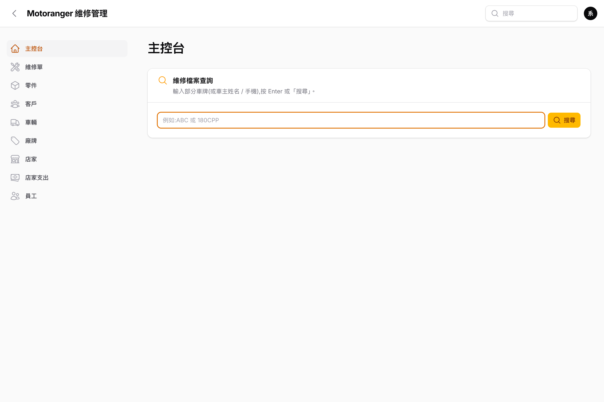
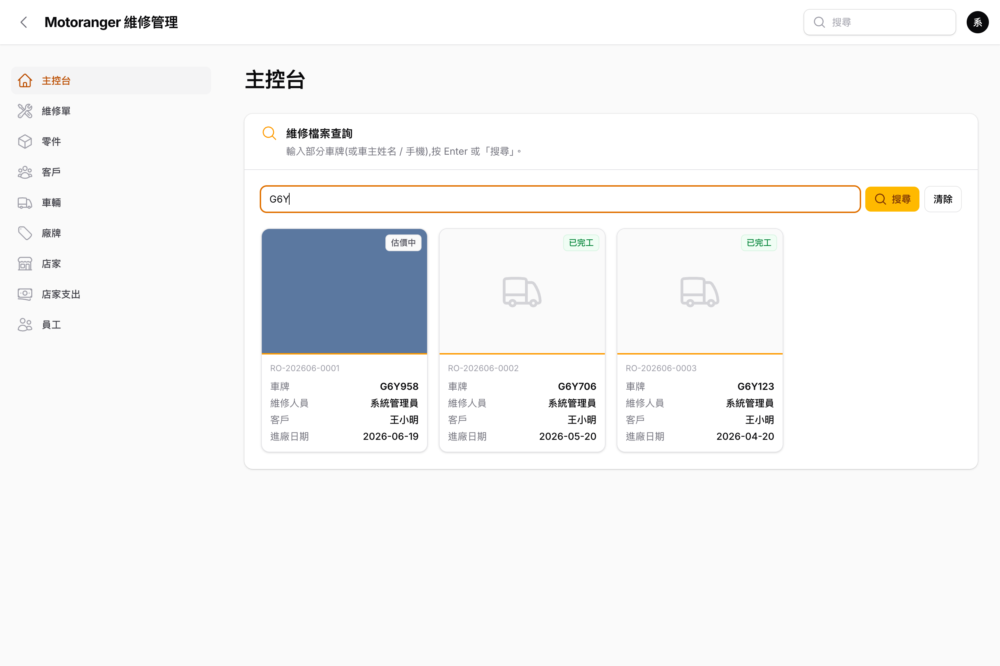

# 01 入門

## 1.1 登入系統

開啟瀏覽器進入 **<https://main.motoranger.net/admin>**,輸入 E-Mail 與密碼後按「登入」。

> 帳號由管理員在「員工」功能中建立;忘記密碼請聯絡系統管理員重設。

## 1.2 主控台:車牌搜尋

登入後進入**主控台**。主控台只保留一個搜尋框,做為日常作業的起點:

1. 在搜尋框輸入**部分車牌**(也可輸入車主姓名或手機),按 **Enter** 或「搜尋」。
2. 系統列出符合的車輛卡片,每張卡片顯示:照片、最新維修狀態、單號、車牌、維修人員、客戶、進廠日期。
3. 點任一張卡片,即進入該車的「**維修檔案頁**」(見 [04 章](../04-customers-vehicles/README.md))。

> 若查無車輛,結果區會出現「**建立車輛**」按鈕(車牌自動帶入搜尋字),建立後直接進入該車檔案頁,馬上就能開單。

## 1.3 介面導覽

- **左側選單**:主控台、維修單、零件、客戶、車輛、廠牌、店家、店家支出、員工,點擊即切換功能。
- **頂部全域搜尋**:可輸入**客戶姓名、手機、車牌、維修單號**,快速跳到對應資料。
- **右上角頭像**:登出系統。
- 側欄可收合,手機與平板亦可操作(響應式介面)。

> **檢視優先**:點維修紀錄、客戶、車輛都會先進入**唯讀檢視頁**,需要修改時再按右上角「編輯」,避免誤改資料。

## 1.4 角色權限

| 角色 | 說明 |
|---|---|
| 管理員 (admin) | 全部功能,含員工帳號管理 |
| 一般員工 (user) | 日常維修、客戶、零件作業 |
