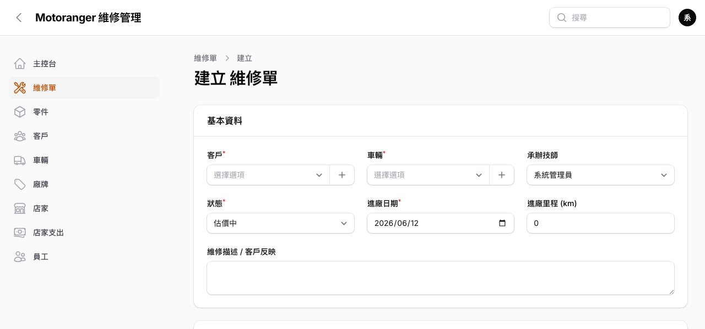
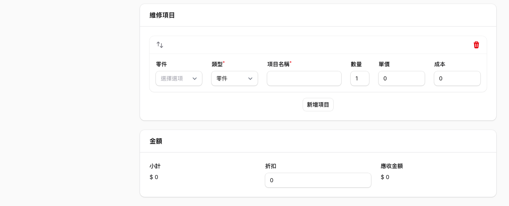
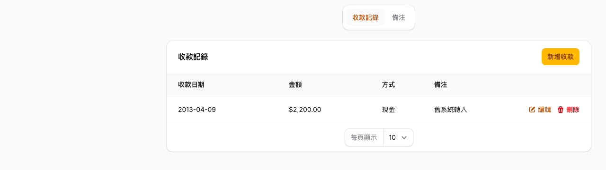

# 02 維修單

維修單是系統核心:從估價、維修到收款交車,都在同一張單上完成。

## 2.1 維修單列表

左側選單點「**維修單**」:

- 欄位:單號、進廠日期、客戶、車牌、狀態、應收、已收、**未收**(紅字代表尚有未收款)。
- 上方可依**狀態**(估價中/已確認/維修中/已完工/已交車/已取消)與**店家**篩選。
- 搜尋框可輸入單號、客戶姓名、車牌。
- 每列右側:「**估價單**」直接開啟列印頁、「編輯」進入維修單。

## 2.2 建立維修單

點右上「**新增 維修單**」:

1. **客戶**:輸入姓名或手機搜尋;新客戶可直接按「+」快速建立(姓名、手機、地址)。
2. **車輛**:選定客戶後,下拉只會列出該客戶的車;新車同樣可按「+」快速建立(車牌、廠牌、車型),選擇車輛後會自動帶入該車最新里程。
3. **承辦技師**:預設為目前登入者。
4. **狀態**:新單預設「估價中」,可隨進度改為已確認 → 維修中 → 已完工 → 已交車。
5. **進廠日期 / 進廠里程 / 維修描述**:記錄客戶反映的問題。

## 2.3 維修項目與金額

- 在「維修項目」按「**新增項目**」逐列輸入;選擇**零件**會自動帶入品名、售價與成本,**工資**類型則直接輸入名稱與金額。
- 數量、單價修改時,下方「小計 / 應收金額」**即時計算**;「折扣」欄輸入折讓金額。
- 儲存後系統自動回寫單頭的小計、應收與已收。

## 2.4 現場照片(拍照)

「現場照片」區按「**新增照片**」即可上傳;手機操作時可直接喚起**相機拍照**。照片支援裁切編輯,並跟著維修單保存,客人掃 QR Code 時也能看到。

## 2.5 收款與備注

進入維修單「編輯」頁面,捲動至底部:

- **收款記錄**:按「新增收款」輸入金額、方式(現金/轉帳/刷卡)、日期;未收金額自動更新。
- **備注**:員工的內部備注、以及**客人掃碼留言**都會顯示在這裡,含作者與時間。
