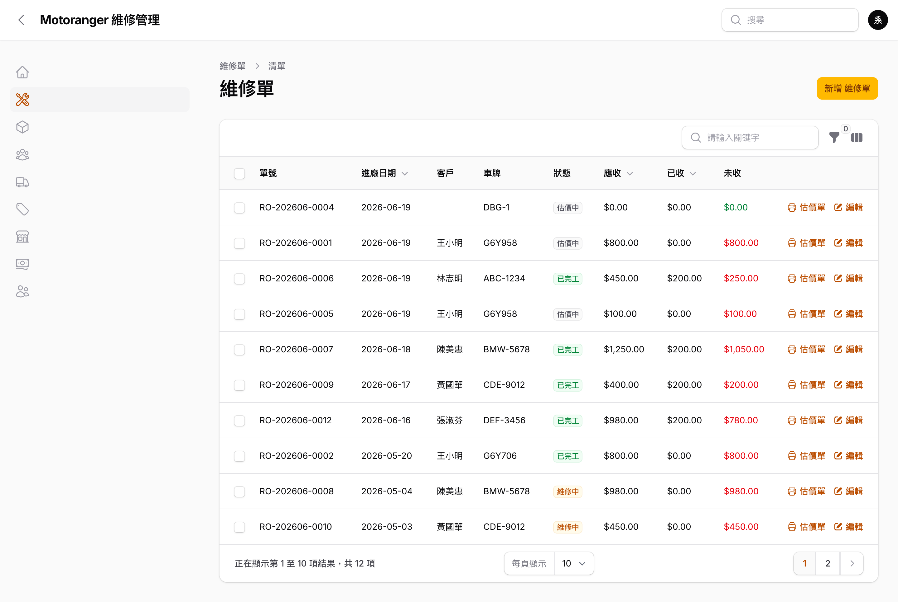
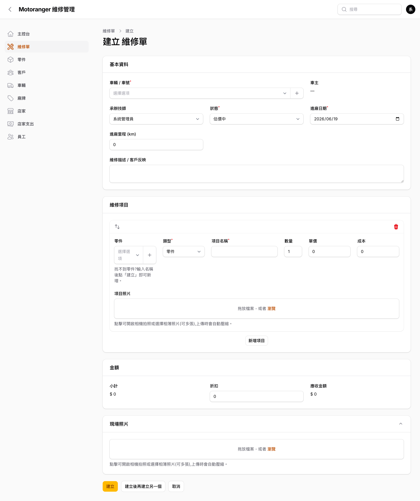
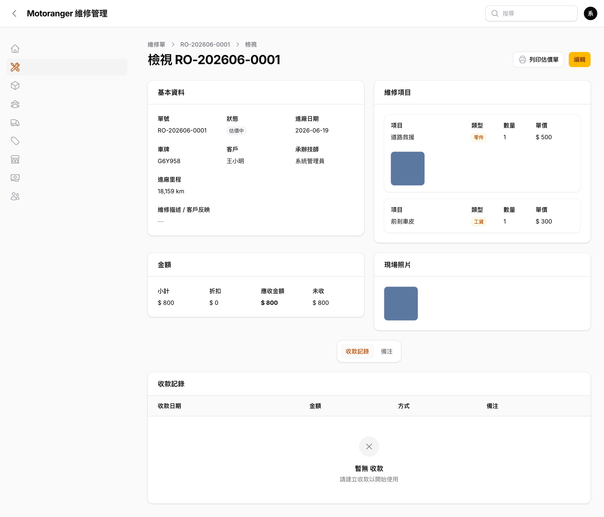

# 02 維修單

維修單是系統核心:從估價、維修到收款交車,都在同一張單上完成。

## 2.1 維修單列表

左側選單點「**維修單**」:

- 欄位:單號、進廠日期、客戶、車牌、狀態、應收、已收、**未收**(紅字代表尚有未收款)。
- 上方可依**狀態**(估價中/已確認/維修中/已完工/已交車/已取消)與**店家**篩選。
- 搜尋框可輸入單號、客戶姓名、車牌。
- 每列右側:「**估價單**」直接開啟列印頁、「編輯」進入維修單。

## 2.2 建立維修單

最常用的方式是從**主控台搜尋車牌 → 車輛維修檔案頁 →「建立維修紀錄」**(見 [04 章](../04-customers-vehicles/README.md));也可在維修單列表右上「**新增 維修單**」直接開單:

1. **車輛 / 車號**:直接輸入車牌搜尋(可搜尋**全部**車輛);找不到時按「**+**」即可當場建立新車(車主可不填)。
2. **車主**:選定車輛後自動帶入,**不需另外選客戶**;若該車尚無車主,維持空白即可。
3. **承辦技師**:預設為目前登入者。
4. **狀態**:新單預設「估價中」,可隨進度改為已確認 → 維修中 → 已完工 → 已交車。
5. **進廠日期 / 進廠里程 / 維修描述**:記錄客戶反映的問題;進廠里程大於車輛現有里程時,會自動回寫車輛最新里程。

## 2.3 維修項目、零件與金額

- 在「維修項目」按「**新增項目**」逐列輸入。
- **零件**:下拉選既有零件會自動帶入品名、售價與成本;**找不到的零件,直接在零件欄按「+」輸入名稱即可新增**,或於「項目名稱」直接打字,儲存時系統會**自動建立零件**並沿用。
- **工資**等非零件項目:類型選「工資」,直接輸入名稱與金額。
- **項目照片**:每個維修項目都可附上照片(手機可直接拍照)。
- 數量、單價修改時,下方「應收金額」**即時計算**;「折扣」欄輸入折讓金額。
- 儲存後系統自動回算單頭的小計、應收與已收。

## 2.4 現場照片(拍照)

「現場照片」區可上傳多張照片;**手機點擊會直接開啟相機拍照**,上傳時系統自動將照片壓縮(約 512KB 內),省流量也加快載入。照片會跟著維修單保存,客人掃 QR Code 時也看得到。

## 2.5 檢視維修單

點任一維修紀錄會先進入**唯讀檢視頁**,完整呈現基本資料、維修項目、金額、現場照片與收款/備注;右上角提供「**編輯**」與「**列印估價單**」:

- 維修項目或現場照片若有圖片,會顯示**縮圖**;點縮圖可**放大檢視**。
- 確認沒問題後再按「**編輯**」修改;需要報價時按「**列印估價單**」(見 [03 章](../03-quotes/README.md))。

## 2.6 收款與備注

在維修單**檢視頁或編輯頁**下方:

- **收款記錄**:按「新增收款」輸入金額、方式(現金/轉帳/刷卡)、日期;未收金額自動更新。
- **備注**:員工的內部備注,以及**客人掃碼留言**都會顯示在這裡,含作者與時間。
