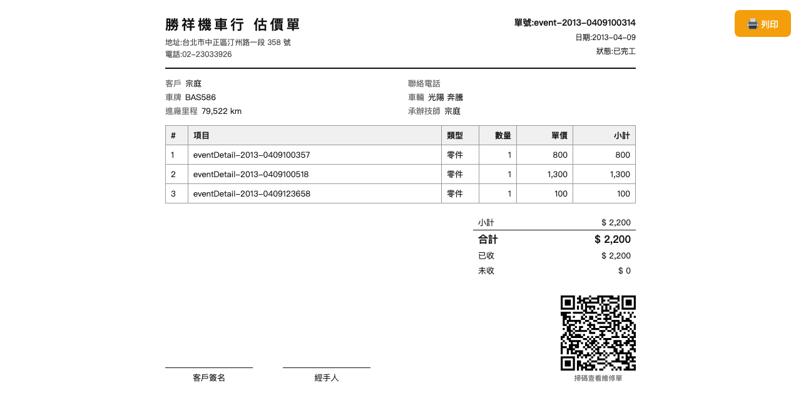
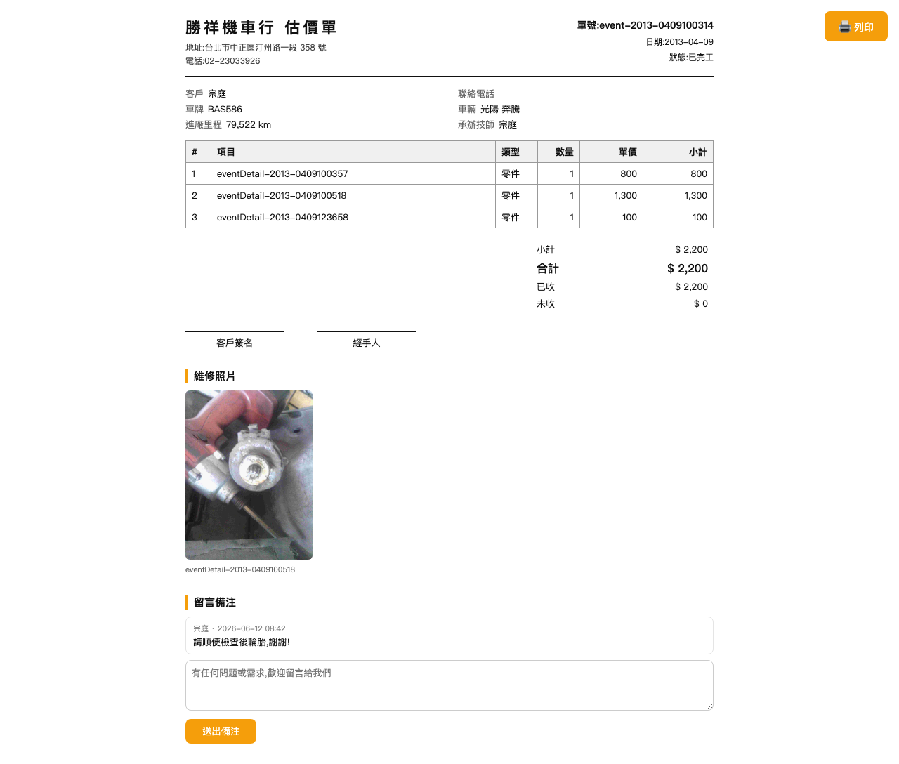

# 03 估價單與 QR Code

## 3.1 列印估價單

維修單列表每列的「**估價單**」按鈕會在新分頁開啟列印版面:

- 內容:店家抬頭(店名/地址/電話/統編)、單號、日期、客戶與車輛資訊、維修項目明細、小計/折扣/合計/已收/未收、客戶簽名與經手人欄位。
- 右上角「🖨 列印」即叫出瀏覽器列印(成本欄**不會**出現在估價單上)。
- 左下角附 **QR Code**,客人掃描即可在手機上查看這張單據。

## 3.2 客人掃碼查詢(公開頁)

客人掃 QR Code 後開啟的頁面(帶簽名保護的專屬連結,他人無法猜測網址):

- 客人可查看:維修明細、金額、**維修照片**。
- **留言備注**:客人可直接在頁面下方留言(例如「請順便檢查後輪胎」),留言會出現在該維修單的「備注」中,作者顯示為該客戶。
- 此頁為唯讀,客人無法修改單據內容。
