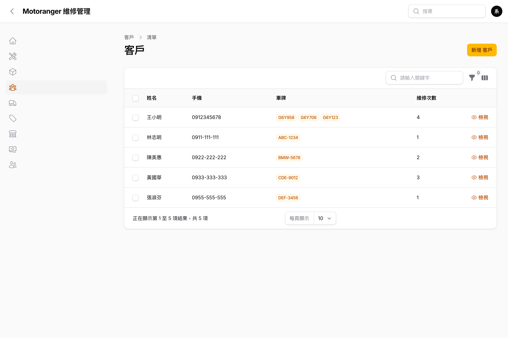
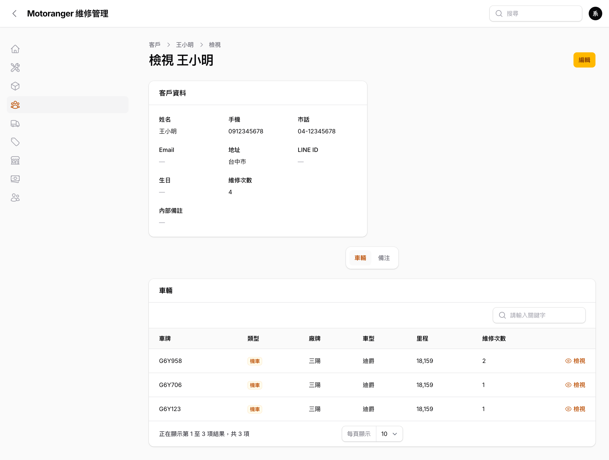
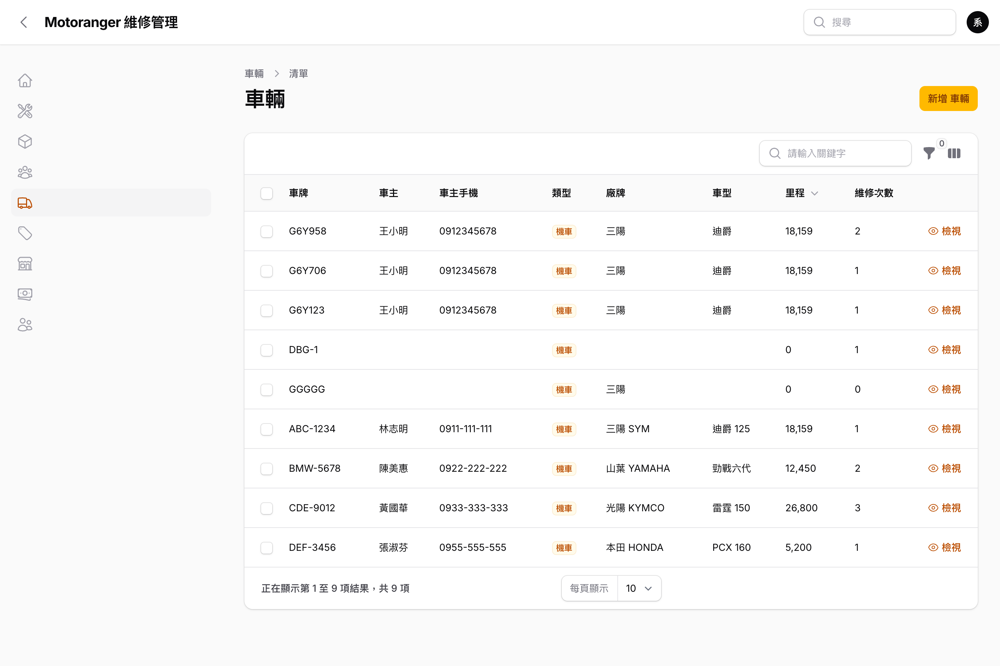
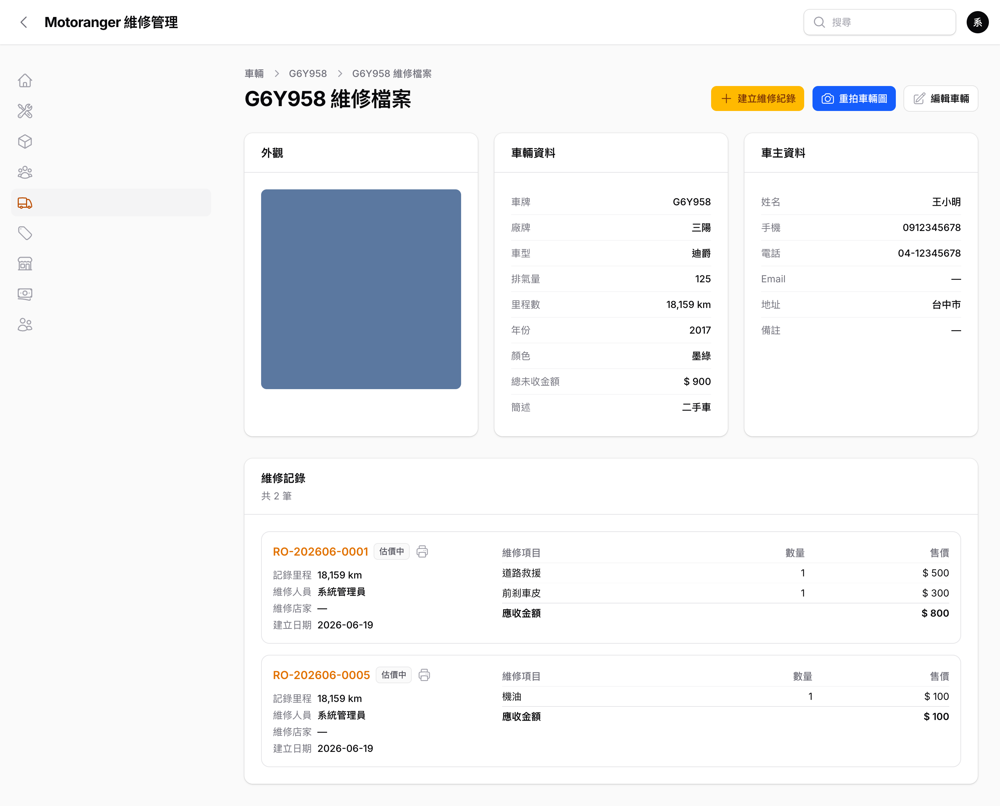

# 04 客戶與車輛

## 4.1 客戶列表

左側選單點「**客戶**」:

- 欄位:姓名、手機、**車牌**(同客戶多台車會並列)、維修次數。
- 搜尋框輸入**姓名、手機或車牌**皆可找到客戶。
- 點任一列(或右側「**檢視**」)會先進入客戶**檢視頁**。

## 4.2 客戶檢視頁(含名下車輛)

- 上方「**客戶資料**」:姓名、手機、市話、Email、地址、LINE ID、生日、維修次數、內部備註。
- 下方「**車輛**」分頁:列出該客戶名下所有車(車牌、類型、廠牌、車型、里程、維修次數);每列可「**檢視**」直接進入該車的維修檔案頁。
- 「**備注**」分頁:記錄客戶相關注意事項(誰寫的、何時寫的都會留存)。
- 右上角「**編輯**」可修改客戶資料。

## 4.3 車輛列表

左側選單點「**車輛**」可瀏覽所有車:

- 欄位:車牌、車主、車主手機、類型、廠牌、車型、里程、維修次數。
- 可依**類型**與**廠牌**篩選;搜尋支援車牌、車主姓名、手機。
- 點任一列(或右側「**檢視**」)進入該車的「**維修檔案頁**」。

## 4.4 車輛維修檔案頁(核心)

這是日常作業的中心頁面 — 從主控台搜尋車牌、或從客戶/車輛清單點「檢視」都會來到這裡:

- 上半三欄:
  - **外觀**:車輛照片(**點圖片可直接更換 / 拍照**)。
  - **車輛資料**:車牌、廠牌、車型、排氣量、里程、年份、顏色、總未收金額、簡述。
  - **車主資料**:姓名、手機、電話、Email、地址、備註。
- 下半「**維修記錄**」:該車歷次維修,含單號、狀態、記錄里程、維修人員、店家、日期與項目明細;點單號進入該單**檢視頁**,旁邊 🖨 可直接列印估價單。
- 右上角三個動作:
  - **建立維修紀錄**:跳出表單(狀態/日期/里程/維修項目/描述/現場照片,皆可拍照),送出後進入該維修單檢視頁。
  - **重拍車輛圖**:替車輛補拍 / 更換外觀照片。
  - **編輯車輛**:修改車輛基本資料。

## 4.5 建立車輛

建立車輛時(列表右上「新增車輛」、開單時的「+」、或搜尋無結果時的「建立車輛」),**車主皆為非必填**,可只先建車牌、之後再補登車主。車輛資料包含:車牌、類型、廠牌、車型、年份、排氣量、顏色、車身號碼、引擎號碼、最新里程,並可上傳車輛照片。
