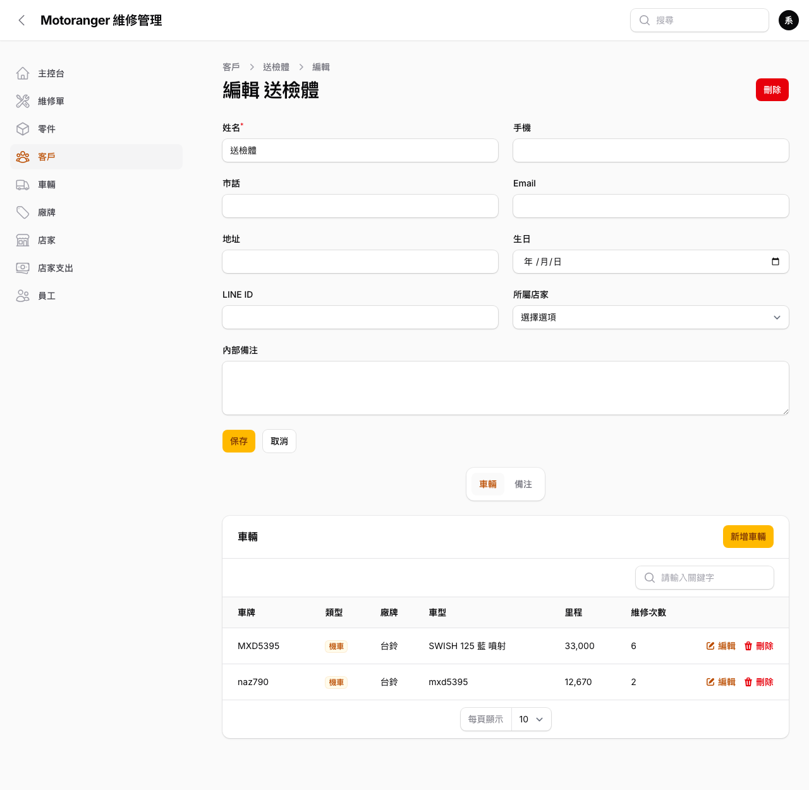

# 04 客戶與車輛

## 4.1 客戶列表與搜尋

左側選單點「**客戶**」:

- 欄位:姓名、手機、**車牌**(同客戶多台車會並列顯示)、維修次數。
- 搜尋框輸入**姓名、手機或車牌**皆可找到客戶;頂部全域搜尋也支援相同條件。

## 4.2 客戶資料與名下車輛

點「編輯」進入客戶資料:

- 基本資料:姓名、手機、市話、Email、地址、生日、LINE ID、內部備注。
- 下方「**車輛**」區直接管理該客戶名下所有車(新增車輛、編輯、檢視維修次數)。
- 「**備注**」區記錄客戶相關的注意事項(誰寫的、何時寫的都會留存)。

## 4.3 車輛列表

左側選單點「**車輛**」可瀏覽所有車:

- 欄位:車牌、車主、車主手機、類型(機車/汽車)、廠牌、車型、里程、維修次數。
- 可依**類型**與**廠牌**篩選;搜尋支援車牌、車主姓名、手機。
- 車輛資料包含:車牌、廠牌、車型、年份、排氣量、顏色、車身號碼、引擎號碼、最新里程,並可上傳**車輛照片**。
