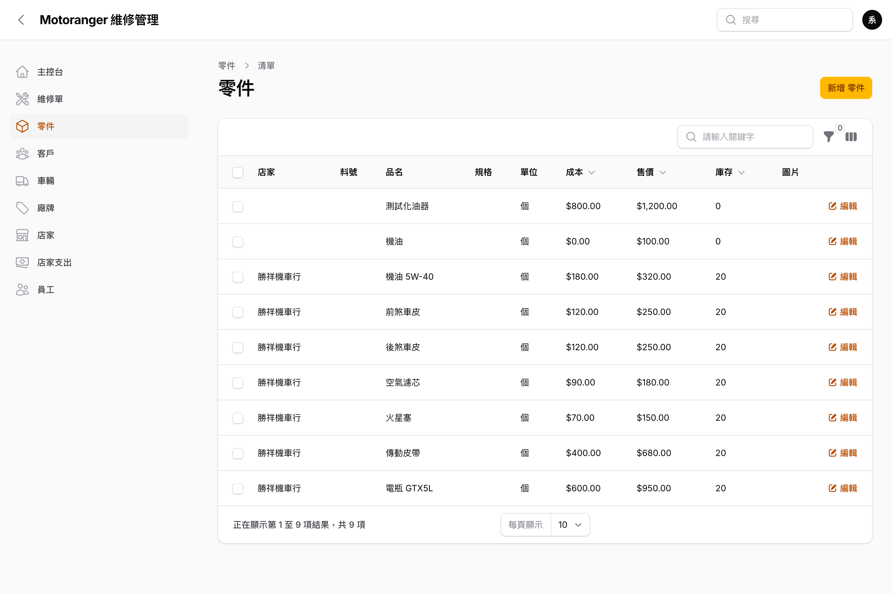

# 05 零件

左側選單點「**零件**」管理零件目錄:

- 欄位:料號、品名、規格、單位、成本、售價、庫存。
- 建立維修單時選擇零件,會**自動帶入品名、售價與成本**,加快開單速度。
- **不必事先建檔**:開單時若零件不在清單中,可在零件欄按「**+**」當場新增,或直接在「項目名稱」輸入,儲存維修單時系統會**自動建立零件**並沿用,下次即可直接挑選。
- 常用耗材(機油、煞車皮、濾芯…)建議先建檔並設定成本/售價。
- 零件可上傳圖片、填寫說明,並指定所屬店家。
