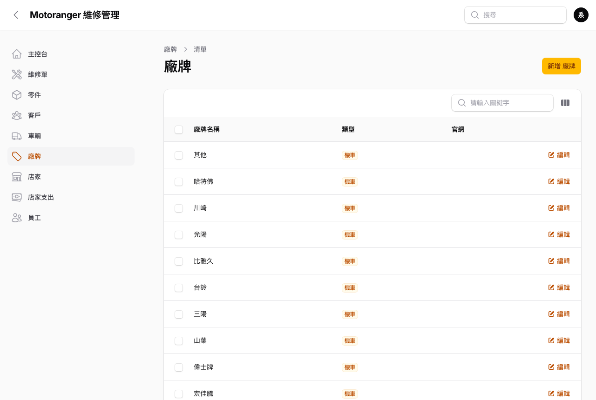
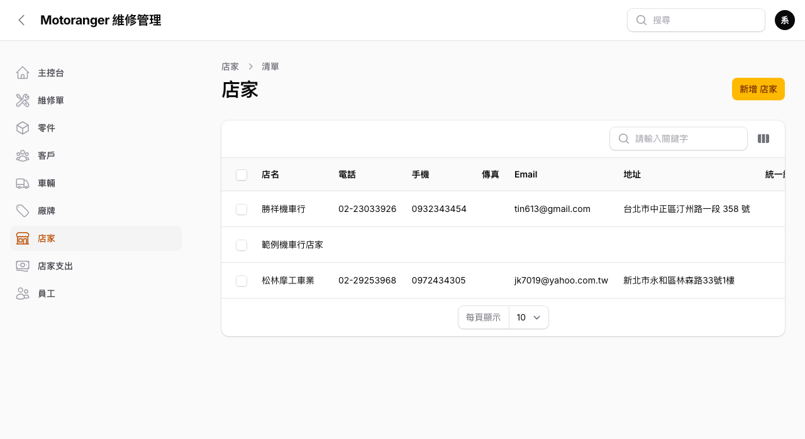
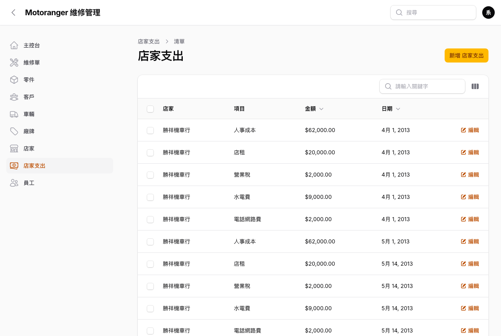
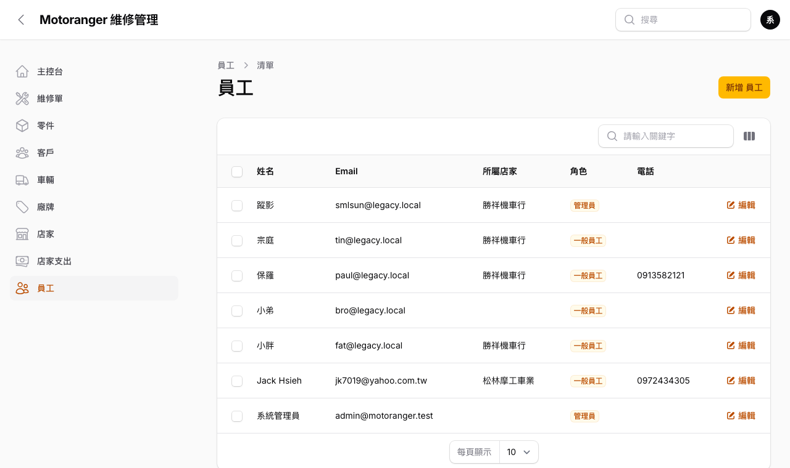

# 06 基礎資料

## 6.1 廠牌

「**廠牌**」維護車輛廠牌(YAMAHA、HONDA、SYM…),類型分機車/汽車/其他,供車輛建檔時選用。

## 6.2 店家

「**店家**」維護門市資料:店名、電話、地址、統一編號、Logo。這些資訊會印在**估價單抬頭**上。

## 6.3 店家支出

「**店家支出**」記錄房租、水電等營業成本,日後產出損益報表使用。

## 6.4 員工帳號

「**員工**」由管理員維護登入帳號:

- 角色:**管理員**(全部功能)/ **一般員工**。
- 新增員工時設定姓名、Email(即登入帳號)、密碼、所屬店家。
- 編輯時密碼欄留空代表不變更;要重設密碼直接輸入新密碼儲存即可。
