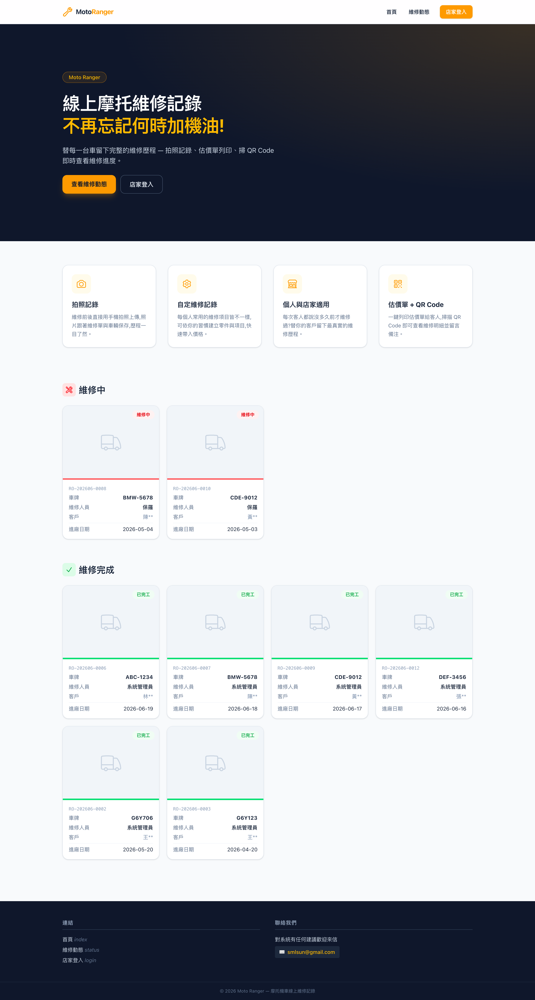

# 07 前台網站

前台 **<https://main.motoranger.net>** 是對外形象頁與維修動態看板,不需登入。

## 7.1 首頁

- 品牌標語與功能介紹。
- 右上角「**店家登入**」即進入後台(`/admin`)。

## 7.2 維修動態

首頁下方公開展示目前的維修狀況:

- **維修中**(紅色標籤)與**維修完成**(綠色標籤)各顯示最新數筆。
- 卡片內容:車輛照片、單號、車牌、維修人員、進廠日期。
- **隱私保護**:客戶姓名一律打碼只顯示姓氏(例:王\*\*),不會洩漏個資。
